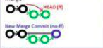

# Push dengan repository yang sudah ada

1. Cek url existing
    ```
    git remote -v
    ```
2. Tambahkan url remote
    ```
    git remote add origin https://github.com/triyasmkom/tutorial_repo.git

    ```
3. Update repository dari remote
    ```
    git fetch
    ```

4. Ambil repository dari remote
    ```
    git pull origin master
    ```
5. Masukkan semua file/folder yang ingin kita commit
    ```
    git add .
    ```
6. Commit semua perubahan
    ```
    git commit -m "tutoarial git"
    ```
7. Push ke repository remote
    ```
    git push origin master
    ```

# Dasar-dasar comment line git
1. membuat repository
    ```
    git init
    ```
2. melihat status perubahan file
    ```
    git status
    ```
3. menambahkan commit
    ```
    git add <nama file/folder>
    ```
4. melakukan commit
    ```
    git commit -m "message commit"
    ```
5. pindah/membuat branch
    ```
    git checkout <nama_branch>
    ```
6. melihat perbedaan perubahan
    ```
    git diff
    ```
7. menghubungkan repository local dengan server
    ```
    git remote add origin <alamat server>
    ```
8. membuat branch baru
    ```
    git checkout -b <nama_branch>
    ```
9. pindah branch 
    ```
    git checkout <branch yg dituju>
    ```
10. menghapus branch
    ```
    git branch -d feature_a
    git branch --delete feature_a
    ```
11. menghapus branch secara paksa
    ```
    git branch -D feature_a

    git branch --delete --force feature_a

    *-D = --delete --force
    ```
12. hapus branch remote
    ```
    git push -d <remote_name> <branch_name>
    git push -d origin example
    ```
13. update dan merging
    ```
    git pull

    git merge <nama_branch>
    ```


# Menyimpan sementara di local sebelum melakukan pull dari remote
1. Cek status perubahan
    ```
    git status
    ```
2. mengabaikan perubahan
    ```
    git stash
    ```
3. pull dari remote
    ```
    git pull
    ```
4. mengembalikan perubahan
    ```
    git stash pop
    ```
5. melihat daftar stash
    ```
    git stash list
    ```
6. menghapus stash
    ```
    git stash clear
    ```

# Git Cheat Sheet
## Setup
Set the name and email that will be attached to your commits and tags.
```shell
git config --global user.name "Triyas"

git config --global user.email "email@example.com"
```

## Start a Project
Create a local repo to initialise the current directory as a git repo

```shell
git init <directory>
```

Download a remote repo

```shell
git clone <url>
```

## Make a Change
Add a file to staging

```shell
git add <file>
```

Stage all files

```shell
git add .
```

Commit all staged files to git

```shell
git commit -m "commit_message"
```

Add all changes made to tracked files & commit

```shell
git commit -am "commit_message"
```


## Basic Concepts

- **Main**: default development branch
- **Origin**: default upstream repo
- **HEAD**: current branch
- **HEAD^**: parent of Head
- **HEAD-4**: great-great grand parent of Head

## Branches

List all local branches. Add -r flag to show all remote branches. -a flag for all brances.

```shell
git branch 
```

Create a new branch 

```shell
git branch <new branch>
```

Switch to a branch & update the working directory

```shell
git checkot <branch>
```

Create a new branch and switch to it

```shell
git checkout -b <new branch>
```

Delete a merged branch

```shell
git branch -d <branch>
```

Delete a branch, whether merged or not

```shell
git branch -D <branch>
```

Add a tag to current commit (often used for new version releases)

```shell
git tag <tag-name>
```


## Merging
Merge branch a into branch b. Add --no-ff option for no-fast-forward merge



```shell
git checkout b

git merge a
```

Merge & squash all commits into pne new commit

```shell
git merge --squash a
```


## Rebasing
Rebase feature branch onto main (to incorporate new change made to main). Prevents unnecessary merge commits into feature, keeping history clean.


```shell
git checkout feature

git rebase main
```

Interactively clean up a branches commits before rebasing onto main

```shell
git rebase -i main
```

Interactively rebase the last 3 commits on current branch

```shell
git rebase -i Head-3
```


## Undoing Things

Move(&/or rename) a file & stage move

```shell
git mv <existing_path> <new_path> 
```

Remove a file from working directory & staging area then stage the removal

```shell
git rm <file>
```

Remove from staging area only

```shell
git rm --cached <file>
```


View a previous commit (READ only)
```shell
git checkout <commit_ID>
```

Create new commit, reverting the changes from a spesified commit

```shell
git revert <commit_ID>
```

Go back to a previous commit & delete all commits ahead of it(revert is saver). Add --hard flag to also delete workspace changes (BE VERY CAREFUL)

```shell
git reset <commit_ID>
```


## Review your Repo

Use new or modified files not yet committed

```shell
git status
```

List commit history, with respective IDs

```shell
git log --oneline
```

Show changes to unstaged files. For changes to staged files, add --cached option

```shell
git diff
```

Show changes between two commits

```shell
git diff commit1_ID commit2_ID
```


## Stashing
Store modified & staged changes. To include untracked files. Add -u flag. For untracked & ignored files, add -a flag.

```shell
git stash
```

As above, but add a comment

```shell
git stash save "comment"
```


Partial stash. Stash just a single file, a collection of files, or individual changes from within files

```shell
git stash -p
```

List all stashes

```shell
git stash list
```

Re-apply the stash without deleting it

```shell
git stash apply
```

Re-apply the stash at index 2, then delete it from the stash list. Omit stash@{n} to pop the most recent stash.

```shell
git stash pop stash@{2}
```

Show the duff summary of stash 1. Pass the -p flag to see the full diff.

```shell
git stash show stash@{1}
```

Delete stash at index 1, Omit stash@{n} to delete last stash made

```shell
git stash drop stash@{1}
```

Delete all stashes

```shell
git stash clear
```


## Synchronizing

Add a remote repo

```shell
git remote add <alias> <url>
```

View all remote connections. Add -v flag to view url

```shell
git remote
```

Remove a connection

```shell
git remote remove <alias>
```

Rename a connection

```shell
git remote rename <old> <new>
```

Fetch all branches from remote repo (no merge)

```shell
git fetch <alias>
```

Fetch a spesific branch

```shell
git fetch <alias> <branch>
```

Fetch the remote repo's copy of the current branch the merge

```shell
git pull
```

Move (rebase) your local changes onto the top of new changes made to the remote repo (for clean, linear history)

```shell
git pull --rebase <alias>
```

upload local content to remote repo

```shell
git push <alias>
```

Upload to a branch (can then pull request)

```shell
git push <alias> <branch>
```


